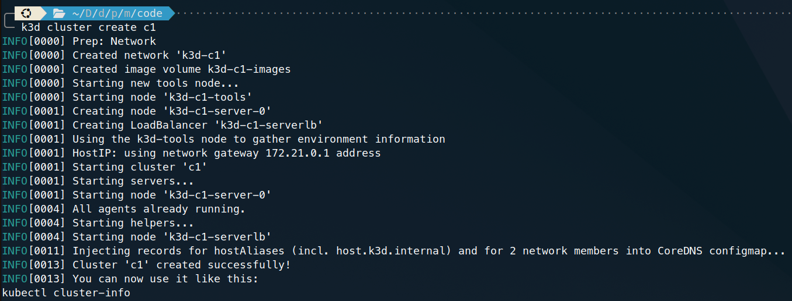
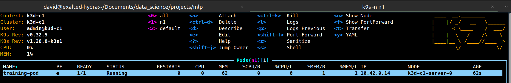
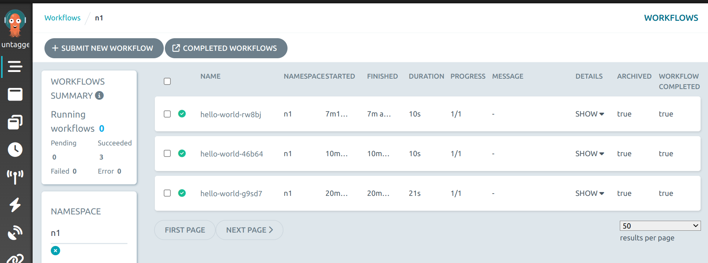
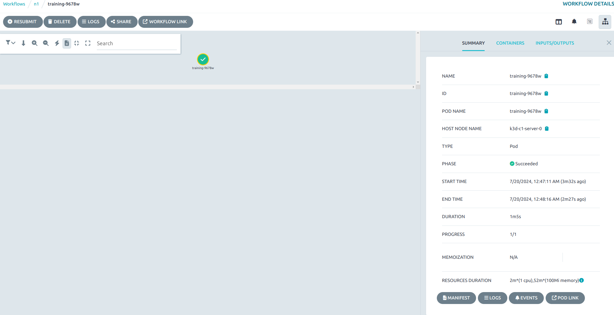

## Installing Local Kubernetes Cluster and submit first Workflow

### Context
k3d is a lightweight wrapper to run Kubernetes clusters inside Docker. It simplifies the creation of single or multi-node Kubernetes clusters using the k3s distribution.

### Prerequisites

Before installing k3d, ensure that you have the following prerequisites:

- Docker: Make sure Docker is installed and running on your system. If Docker is not installed, follow the Docker installation [guide](https://docs.docker.com/engine/install/ubuntu/).

```bash
docker --version
```

- curl: You’ll need curl to download k3d.
```bash
curl --version

#Output: 
#  curl 7.81.0 (x86_64-pc-linux-gnu) libcurl/...

# Otherwise install with
# sudo apt update
# sudo apt install curl -y
```

#### Installing Kubernetes CLI

The Kubernetes command-line tool, kubectl, allows you to run commands against Kubernetes clusters. We can follow instructions on the official [page](https://kubernetes.io/docs/tasks/tools/). Ensure installation with:
```bash
kubectl version --client

# Output:
# Client Version: v1.30.2
# Kustomize Version: v5.0.4-0.20230601165947-6ce0bf390ce3
```

#### Installing K3D

K3s is a fully conformant lightweight production-ready Kubernetes distribution. We can follow instructions on the official [page](https://k3d.io/v5.6.3/#releases):

```bash
curl -s https://raw.githubusercontent.com/k3d-io/k3d/main/install.sh | bash
```

Ensure installation with:
```bash
k3d --version

# Output:
# k3d version v5.6.3
# k3s version v1.28.8-k3s1 (default)

```

## Creating our first cluster

Create a cluster named mycluster with just a single server node:

```bash
k3d cluster create c1
```

You will see something like: 
```bash
INFO[0000] Prep: Network                                
INFO[0000] Created network 'k3d-c1'                     
INFO[0000] Created image volume k3d-c1-images           
INFO[0000] Starting new tools node...                   
INFO[0000] Starting node 'k3d-c1-tools'                 
INFO[0001] Creating node 'k3d-c1-server-0'              
INFO[0001] Creating LoadBalancer 'k3d-c1-serverlb'      
INFO[0001] Using the k3d-tools node to gather environment information 
INFO[0001] HostIP: using network gateway 172.21.0.1 address 
INFO[0001] Starting cluster 'c1'                        
INFO[0001] Starting servers...                          
INFO[0001] Starting node 'k3d-c1-server-0'              
INFO[0004] All agents already running.                  
INFO[0004] Starting helpers...                          
INFO[0004] Starting node 'k3d-c1-serverlb'              
INFO[0011] Injecting records for hostAliases (incl. host.k3d.internal) and for 2 network members into CoreDNS configmap... 
INFO[0013] Cluster 'c1' created successfully!           
kubectl cluster-info
```

If you want multiple worker nodes and a server node you could use:
```bash
k3d cluster create myK3sCluster --agents 2
```
However for the sake of simplicity we will stick to a single-node cluster.

Let's double check our cluster was created correctly:
```bash
k3d cluster list 

# Output:
#NAME           SERVERS   AGENTS   LOADBALANCER
#c1             1/1       0/0      true
```

We need now to start the cluster:
```bash
k3d cluster start c1

# Output:
# INFO[0000] Using the k3d-tools node to gather environment information 
# INFO[0000] Starting new tools node...                   
# INFO[0000] Starting node 'k3d-c1-tools'                 
# INFO[0000] HostIP: using network gateway 172.21.0.1 address 
# INFO[0000] Starting cluster 'c1'                        
# INFO[0000] All servers already running.                 
# INFO[0000] All agents already running.                  
# INFO[0000] All helpers already running.                 
# INFO[0000] Started cluster 'c1'
```

## Interacting with our cluster
To interact with your k3d cluster using kubectl, configure the `KUBECONFIG` environment variable:
```bash
export KUBECONFIG=$(k3d kubeconfig write c1)

# Output:
# echo $KUBECONFIG
# /home/david/.config/k3d/kubeconfig-c1.yaml
```

We can inspect the contents of such yaml. The kubeconfig file provides all the necessary details for kubectl to interact with a Kubernetes cluster. It defines clusters, users, and contexts for different Kubernetes environments:
```bash
apiVersion: v1
clusters:
- cluster:
    certificate-authority-data: XXXXX
    server: https://0.0.0.0:33345
  name: k3d-c1
contexts:
- context:
    cluster: k3d-c1
    user: admin@k3d-c1
  name: k3d-c1
current-context: k3d-c1
kind: Config
preferences: {}
users:
- name: admin@k3d-c1
  user:
    client-certificate-data: XXXX
    client-key-data: XXXX
```

An important concept here is `contexts`, which define connections between clusters and users:
- name: The context name (k3d-c1).
- context: Details the specific cluster and user configuration:
- cluster: The cluster to connect to (k3d-c1).

We can double check the current context is the one defined in the YAML file:
```bash
kubectl config get-contexts

# Output:
# CURRENT   NAME     CLUSTER   AUTHINFO       NAMESPACE
# *         k3d-c1   k3d-c1    admin@k3d-c1
```

Otherwise, if another context is set, we can change it with
```bash
kubectl config use-context k3d-c1
```

We should confirm that kubectl can communicate with the cluster:
```bash
kubectl cluster-info

# Output:
# Kubernetes control plane is running at https://0.0.0.0:33345
# CoreDNS is running at https://0.0.0.0:33345/api/v1/namespaces/kube-system/services/kube-dns:dns/proxy
# Metrics-server is running at https://0.0.0.0:33345/api/v1/namespaces/kube-system/services/https:metrics-server:https/proxy
```

This address that appears in the Kubernetes control plane output, `https://0.0.0.0:33345` it's not accessible through the browser (when you attempt to access the server directly by a browser or a basic HTTP client, we are not providing the sufficient credentials to access the server). Instead, this is the reason why we use the `kubectl` CLI, which uses the credentials specified in the `kubeconfig` file we've seen to authenticate and authorize requests. If we are interested in diving deep into it, we can interact with the API server using proxy requests:

```bash
# In Terminal 1
kubectl proxy

# keep this terminal running
```

In order to perform any operation that `kubectl` does we can also do it with `curl` requests, for example, getting the number of pods (which in our newly created cluster should be empty):

```bash
# In Terminal 2 (open new terminal)
curl http://localhost:8001/api/v1/namespaces/default/pods

# Output:
# {
#   "kind": "PodList",
#   "apiVersion": "v1",
#   "metadata": {
#     "resourceVersion": "1327"
#   },
#   "items": []
# }
```
However, for the sake of simplicity, we will use the `kubectl` CLI throughout this tutorial:
```bash
# Equivalent to the above curl request
kubectl get pods

# Output:
# No resources found in default namespace.
```

## Submitting our first task to the cluster

We are going to containerize a dummy training pipeline to submit our first execution on the Kubernetes cluster. To do so, we need to build a container, which will host a Python training script which will perform the training. We are going to use `docker-compose` to manage the container:

### Creating the files

```{python}
import numpy as np
from sklearn.datasets import load_iris
from sklearn.linear_model import LogisticRegression
from sklearn.model_selection import train_test_split
from sklearn.metrics import accuracy_score
import joblib
import time

# Load the Iris dataset
iris = load_iris()
X = iris.data
y = iris.target

# Split the dataset into training and testing sets
print("Splitting dataset")
time.sleep(20)
X_train, X_test, y_train, y_test = train_test_split(
    X, y, test_size=0.2, random_state=42
)

# Train a logistic regression model
model = LogisticRegression(max_iter=200)
print("Fitting dataset")
time.sleep(20)
model.fit(X_train, y_train)

# Make predictions
print("Predicting on test")
time.sleep(10)
y_pred = model.predict(X_test)


# Calculate accuracy
print("Calculating accuracy")
time.sleep(5)
accuracy = accuracy_score(y_test, y_pred)
print(f"Accuracy: {accuracy * 100:.2f}%")

# Save the model (optional)
print("Saving model")
time.sleep(5)
joblib.dump(model, "model.joblib")
```
We will create a `requirements.txt` to specify Python dependencies:

```bash
numpy
scikit-learn
```

And we will containerize the training with Docker, using a very slim image suitable for python. We will create this `.Dockerfile`:
```bash
FROM python:3.9-slim
WORKDIR /app
COPY requirements.txt requirements.txt
RUN pip install -r requirements.txt
COPY . .
# Locate entrypoint to run
COPY bin/entrypoint /entrypoint
# Execute permissions
RUN chmod +x /entrypoint
ENTRYPOINT ["/entrypoint"]
```

As specified, we will use an entrypoint defined in `bin/entrypoint` to trigger the training with a single command. To do so, let's create `bin` folder and a file named `entrypoint` inside of it:

```bash
#!/usr/bin/env bash

cmd=$1

case "$cmd" in
"train")
    echo "Training..."
    python /app/train.py
;;
esac
```

Finally, let's have `docker-compose.yml` orchestrate this container:
```text
version: '3.8'

services:
  reg:
    build: .
    image: image-reg:latest
    volumes:
      - .:/app
    command: ""
```

We are building a service for the regression task (`reg`) whose image will be named `image-reg`.

### Build the container

Now we will build the container and run it locally to see that we can perform a training inside this container. This training will not happen inside the Kubernetes cluster yet, it is simply a Python script running inside a container:

```bash
docker compose build
docker compose run --entrypoint=bash reg '-l'
# you may either use docker-compose if docker compose is not found
```

The last command will make you enter inside the container. There you can run the `train` command as defined in the entrypoint

```bash
/entrypoint train
# Training...
# Splitting dataset
# Fitting dataset
# Predicting on test
# Calculating accuracy
# Accuracy: 100.00%
# Saving model

```

This should trigger the training. If you exit the container, you can access it again with:
```bash
docker ps -a

#CONTAINER ID   IMAGE
#8236781a13f6   image-reg:latest
docker start 8236781a13f6
docker exec -it 8236781a13f6 bash
/entrypoint train
```

### Pushing the Docker image in the remote registry

Kubernetes typically pulls images from a remote registry like Docker Hub. Although it is possible to set a private local Docker registry, it is advisory to have your personal DockerHub account where you push your image. Let's tag the image and push it to our remote DockerHub registry:

```bash
# replace: davidamat by your username
docker tag image-reg:latest davidamat/image-reg:latest
docker login
docker push davidamat/image-reg:latest
```
Follow any tutorial online to configure properly the `docker login` with your account. In my case, you can see the uploaded image in [DockerHub - davidamat/image-reg](https://hub.docker.com/repository/docker/davidamat/image-reg/general).

### Creating a namespace

Overall, namespaces in Kubernetes are essential for managing complexity, improving security, enabling multi-tenancy, and facilitating efficient resource allocation and management within a Kubernetes cluster. Inside our `c1` cluster we will create a `namespace` named `n1`.

```bash
kubectl create ns n1
```


### Launching the manifest

Create a YAML file that we can name as `train-manifest.yaml` which will include:

```bash
apiVersion: v1
kind: Pod
metadata:
  name: training-pod
  namespace: n1 # put here your namespace
spec:
  containers:
  - name: training-container
    image: davidamat/image-reg:latest  # Replace with your Dockerhub registry image name
    command: ["/entrypoint", "train"]
    resources:
      limits:
        memory: "5Gi"  # Adjust memory limit as needed
        cpu: "2"       # Adjust CPU limit as needed
  restartPolicy: Never
```

Now we will submit this manifest to the cluster:

```bash
kubectl apply -f train-manifest.yaml
```

You will see that a pod gets created with the name `training-pod`:

```bash
kubectl get pods -n n1

#NAME           READY   STATUS    RESTARTS   AGE
#training-pod   1/1     Running   0          46s
```

We can have further information about the Pods metadata in:

```bash
kubectl describe pod training-pod -n n1
```

It is also interesting to view the pod logs (the prints we did inside the python script in this case). For the logs we must specify both the pod name and the container name (see `train-manifest.yaml`):

```bash
kubectl logs training-pod -c training-container -n n1

# Training...
# Splitting dataset
# Fitting dataset
# Predicting on test
# Calculating accuracy
# Accuracy: 100.00%
# Saving model

# You can follow live the pod logs while being executed using the tail function
kubectl logs -f training-pod -c training-container -n n1

# Or use the watch command to update such logs every second
watch -n 1 'kubectl logs -f training-pod -c training-container -n n1'
```

### Installing k9s for Kubernetes dashboarding

K9s is a terminal-based Kubernetes dashboard that provides a streamlined interface for monitoring and managing Kubernetes clusters. It offers real-time visibility into cluster resources, allowing users to efficiently monitor pods, deployments, services, and logs without needing to switch between multiple command-line tools or browser tabs. For example, while I was executing the `apply` of the manifest I ran `k9s -n n1` in my terminal (please install it from any tutorial if you don't have it):



It is good to see the `Status` of the Pod and also the computing resources it is taking. This is specially useful when we have multiple executions in the cluster happening in parallel under the same namespace. If you hover over that pod you want to see the logs, simply by pressing `l` you will see the logs.


## Installing Argo and submiting first Argo Workflow

### Install Argo from the official tutorial

In our case the commands will be:

```bash
curl -sLO https://github.com/argoproj/argo-workflows/releases/download/v3.5.7/argo-linux-amd64.gz
gunzip argo-linux-amd64.gz
chmod +x argo-linux-amd64
mv ./argo-linux-amd64 /usr/local/bin/argo  # maybe you need sudo permissions so add "sudo" at the start
argo version

# Output:
# argo: v3.5.7
#   BuildDate: 2024-05-27T07:01:54Z
#   GitCommit: 503eef1357ebc9facc3f463708031441072ef7c2
#   GitTreeState: clean
#   GitTag: v3.5.7
#   GoVersion: go1.21.10
#   Compiler: gc
#   Platform: linux/amd64
```

### Install Argo Workflows in the cluster

If we choose to go for the quick start guides, we must ensure that we change the namespace from the assumed one `argo` to the one that we are dealing with here `n1`. To do so, access the `https://raw.githubusercontent.com/argoproj/argo-workflows/master/manifests/quick-start-postgres.yaml` YAML file, and create a local file in a given path (i.e `code/argo/quick-start-progress.yaml`) and replace `namespace: argo` by `namespace: n1`. Then we can apply it to our namespace:

```bash
kubectl apply -n n1 -f code/argo/quick-start-progress.yaml
```

Ensure several pods are created, apart from the existing `training-pod`:


```bash
kubectl get pods -n n1
# NAME                                   READY   STATUS      RESTARTS   AGE
# training-pod                           0/1     Completed   0          3d1h [ALREADY EXISTING]
# httpbin-6c989cbc8c-475zh               1/1     Running     0          5m42s
# minio-6d79d685d-8bbkb                  1/1     Running     0          5m42s
# postgres-6798cb7cb-dpw9k               1/1     Running     0          5m42s
# workflow-controller-6b4c59d6fd-bs4cv   1/1     Running     0          2m54s
# argo-server-7dfb5c7ccc-6bx7g           1/1     Running     0          2m54s

```
### Submit our first workflow

We will use the default `hello-world.yaml`that Argo provides in order to first check the installation and the process of submitting the Argo workflow is healthy. Create in a given file, named `hello-world.yaml` the following manifest:

```yaml
apiVersion: argoproj.io/v1alpha1
kind: Workflow # new type of k8s spec used to create argo workflows
metadata:
  generateName: hello-world- # name of the workflow spec
spec:
  entrypoint: whalesay # specifies the initial template that should be invoked i.e whalesay
  templates:
    - name: whalesay # name of the template
      container: # container that will run when this template in invoked
        image: docker/whalesay # image that will run inside the cluster
        command: [cowsay]
        args: ["hello world"]
        resources: # limit the resources
          limits:
            memory: 32Mi
            cpu: 100m
```

Let's submit it and monitor its status. To do so in real time, let's open two terminals:
In Terminal 1 we will watch the current status of all the workflows in that namespace `n1`:

```bash
# Terminal 1
watch -n 1 'argo list -n n1 '

# No workflows created yet
```

Then in Terminal 2, we will submit the hello world workflow:

```bash
argo submit -n n1 --watch hello-world.yaml 
```

We will see that we are triggering a STEP named `whalesay` which is the template name we defined in our manifest. This template pulls the image from `docker/whalesay` and executes the command `cowsay` inside that pod. We can see immediately that a Pod the status is `Running` for the workflow defined. See that automatically, Argo adds a random suffix (here `g9sd7`) to the defined `generateName` in the manifest:

```bash
# Terminal 1

# NAME                STATUS    AGE   DURATION   PRIORITY   MESSAGE
# hello-world-g9sd7   Running   2s    2s         0
```

We wait until the step finishes running and the status gets to `SUCCEEDED`:

```bash
# Terminal 1

# NAME                STATUS      AGE   DURATION   PRIORITY   MESSAGE
# hello-world-g9sd7   Succeeded   4m    21s        0
```

Now we can also monitor the logs of that pod, to see what has the command `cowsay` produced as output. Pick the pod name (in my case `hello-world-g9sd7`, careful cause yours will be different):

```bash
argo logs hello-world-g9sd7 -n n1

# We will see the Whalesay typical print
```

As an alternative, use `k9s`:

```bash
k9s -n n1
# Go to the row of the hello-world-g9sd7 pod NAME, and press `l` key, which will show the logs
# Press ESC to return
```

`k9s` offers many other interesting options apart from visualizing the Pod logs, like accessing the Shell of the running Pod. Try to delete your pod with `Ctrl + D` and delete it. You will realize that at every submit a new pod name gets created. This is the beauty of Argo and its ability to easily manage pods executing tasks.


### Argo Workflows UI

Sometimes, it is a bit cumbersome to do the monitoring with terminal commands. One would appreciate a more UI/UX friendly interface to visualize, handle and submit workflows. This is the purpose of Argo Workflows UI. To run it locally and access it through your browser run:

```bash
kubectl -n n1 port-forward deployment/argo-server 2746:2746
```

We are targeting our argo-server pod that is up and running, in which we will have the Argo Workflows server running. It simply provides a web-based user interface and REST API for interacting with Argo workflows. With a simple port-forwarding, in our browser we are able to access the Workflows UI. So go to your browser and navigate to:

```bash
https://localhost:2746/

# if asked about private connection, just go to Advanced and click on Proceed
```

You will see something like:
 

### Submiting a workflow from a Workflow Template

Go to the second icon in the left menu named `Workflow Templates`. You will realize that we don't have any Workflow Template, but we have already submited a Workflow... Well, if you inspect carefully the YAML of the `hello-world.yaml` you will realize that the `kind: Worflow` indicated that it was a yaml manifest for submiting a Workflow. In order to create a Workflow template from which to run multiple workflows from it (maybe different workflows have different input arguments) we will create a template. Create a file named `hello-world-template.yaml`:

```bash
apiVersion: argoproj.io/v1alpha1
kind: WorkflowTemplate # specify this as a WorkflowTemplate
metadata:
  name: hello-world-template # name of the workflow template
spec:
  entrypoint: whalesay # specifies the initial template that should be invoked
  templates:
    - name: whalesay # name of the template
      container: # container that will run when this template is invoked
        image: docker/whalesay # image that will run inside the cluster
        command: [cowsay]
        args: ["hello world"]
        resources: # limit the resources
          limits:
            memory: 32Mi
            cpu: 100m

```

And apply it (two possible options):

```bash
argo template create hello-world-template.yaml -n n1
# Option 2: kubectl apply -f hello-world-template.yaml

# Output:
# Name:                hello-world-template
# Namespace:           n1
# Created:             Fri Jul 19 23:41:10 +0200 (1 second ago)
```

Now refresh the `Workflows Template` section and you will see the `hello-world-template`. Now we can submit a given workflow from a template with

```bash
argo submit --from workflowtemplate/hello-world-template -n n1
```

See that in the UI, in the `Workflows` section, we will see a workflow named something like `hello-world-template-XXXX` with some random suffix. 


<div style="border: 2px solid #FFA500; background-color: #343434; padding: 10px; border-radius: 5px; margin: 10px 0;">
  <strong>Warning</strong>: You will realize in the Workflows Templates that you cannot submit a given workflow template. We won't need this functionality of the UI for this tutorial, since most workflows will be executed from Hera Workflows.
</div>

### Submit the training 

Let's adapt our `train-manifest.yaml` to create an Argo workflow manifest that we can submit. Let's create `train-argo.yaml`:

```yaml
apiVersion: argoproj.io/v1alpha1
kind: Workflow # new type of k8s spec used to create argo workflows
metadata:
  generateName: training- # name of the workflow spec
spec:
  entrypoint: training-template # specifies the initial template that should be invoked i.e whalesay
  templates:
    - name: training-template # name of the template
      container: # container that will run when this template in invoked
        image: davidamat/image-reg:latest # image that will run inside the cluster
        command: ["/entrypoint", "train"]
        resources: # limit the resources
          limits:
            memory: "5Gi"
            cpu: "2"

```

See that we are using the same Docker image, the same command, and we have named the workflow name prefix to be `training-`. Let's submit it:


```bash
argo submit -n n1 --watch train-argo.yaml 
```

We can see in the Workflows UI a Workflow being triggered and running. We can click on it and inspect the Pod logs by clicking at the Pod running (or finished) and in the `Summary` section we can click on `Logs`:

 

Congratulations, your cluster is ready for the next step to integrate Hera Workflows.

## Hera Workflows

Creating a YAML syntax for your training pipelines is a pain. Some training pipelines involve complex DAG configuration of steps, each of them with specific logic and interwined inputs and outputs that are passed from task to task in the DAG. We did not deep dive into the capabilities of the `Workflow` manifest, but it basically allows very complex DAG configurations, at the cost of an unbearable syntax that makes it impossible to maintain or hand over. Instead, several approaches to add syntax sugar to facilitate the automatic creation of such YAMLs via a programming language like Python are the standards of the industry. In particular, we have been using a lot [py-dagger](https://github.com/larribas/dagger). The problem with such approaches is that they create the YAML manifest of your training DAG but they don't submit them to Argo Workflows. Instead, you have to rely on an Argo development lifecycle, which places the manifest into a GitOps repository, which then, via ArgoCD, communicates with Argo, and synchs the manifests, so if you manually execute the workflow again, the new changes propagate to the cluster executing the manifest. This complex lifecycle makes development slow and tedious, with lots of steps adding latency. Hera Worklows is a good solution to address such limitation.

We will create a simple Hera Workflow script in python and try to submit it to the cluster:

### Installing Hera Workflows in a Python Environment

```bash
pyenv local 3.9.11
pyenv virtualenv 3.9.11 hera_env
pyenv activate hera_env
pip install hera-workflows
```

Let's run our first hello-world. Create a Python file named `hello-world-hera.py` with:


```python
from hera.workflows import Steps, Workflow, script
from hera.shared import global_config

global_config.host = "https://localhost:2746"
global_config.token = ""  # Copy token value after "Bearer" from the `argo auth token` command
global_config.image = "python:3.12.4-slim"  # Set the image if you cannot access "python:3.8" via Docker Hub
global_config.verify_ssl = False  # Set to False if you are using a self-signed certificate


@script()
def echo(message: str):
    print(message)


with Workflow(
    generate_name="hello-world-verify-ssl-false-",
    entrypoint="steps",
    namespace="n1",
) as w:
    with Steps(name="steps"):
        echo(arguments={"message": "Hello world!"})


if __name__ == "__main__":

    w.create()
```

Note that `global_config.verify_ssl = False` is important since we are working locally without any SSL verification. Execute this python file inside the created environment:

```bash
python hello-world-hera.py
```

Go to the Argo UI and check how a new workflow has been triggered. Congratulations! This is your first submit on an Hera Workflow.

### Training pipeline in Hera

Now let's get into business. We have our `train.py` file which we containerized and we created the `train-argo.yaml` Workflow to submit the training. Now, instead of creating the YAML, we will replicate the behaviour of submitting this workflow as a YAML, with simply submitting the workflow by executing a Python file. For this, the syntax of the `train-hera.py` file will be:

```python
from hera.workflows import Steps, Workflow, Container
from hera.shared import global_config

# Configure Hera global settings
global_config.host = "https://localhost:2746"
global_config.token = ""  # Copy token value after "Bearer" from the `argo auth token` command
global_config.verify_ssl = False  # Set to False if you are using a self-signed certificate

# Define the container that runs the training job
train_container = Container(
    name="train",
    image="davidamat/image-reg:latest",
    command=["/entrypoint", "train"],
    resources={"limits": {"memory": "5Gi", "cpu": "2"}},
)

# Create the workflow
with Workflow(
    generate_name="training-hera-",
    entrypoint="training-steps",
    namespace="n1",
) as w:
    with Steps(name="training-steps"):
        train_container()

if __name__ == "__main__":
    w.create()

```

Run it with `python train-hera.py ` and... Amazing! Your training manifest has now been migrated to Hera Workflows.


-----------------------------------------------------------------

# TODOS: 

 

Deleting roles 
```bash
kubectl delete rolebinding argo-binding -n n1
kubectl delete rolebinding argo-server-rolebinding -n n1
kubectl delete role argo-role -n n1
kubectl delete role argo-server-role -n n1
```
```bash

```
```bash

```
```bash

```
```bash

```
```bash

```